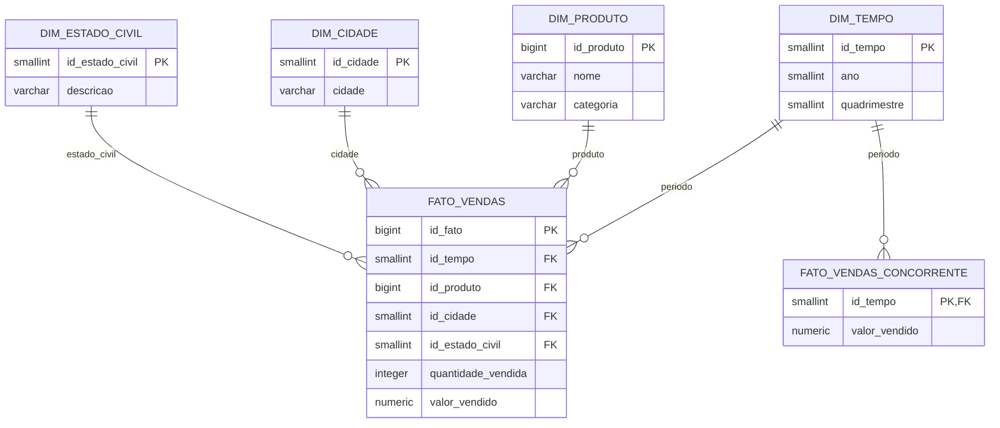

# Mineração de Dados — Pet Shop Nosso Aumigo

Este projeto integra as vendas de produtos das filiais Salvador, Itabuna e Feira de Santana em um banco OLAP PostgreSQL, além das vendas mensais da concorrente para fins de comparação.

## Arquitetura medalhão

```text
Bronze  -> fontes brutas: Oracle, PostgreSQL, MongoDB e Excel
Silver  -> itens de venda próprios, padronizados e ainda sem agregação
Gold    -> esquema estrela PostgreSQL, agregado para análise
```

- **Bronze:** os repositórios extraem os dados sem aplicar regra analítica.
- **Silver:** cada item de venda recebe cidade da filial, estado civil normalizado, produto/categoria padronizados, ano e quadrimestre. Seu grão continua sendo um item de venda.
- **Gold:** consolida os itens no grão `ano × quadrimestre × produto × cidade × estado civil`.

A planilha da concorrente segue o mesmo fluxo Bronze → Silver → Gold, mas num pipeline separado: ela só traz `Ano`, `Mês` e `Vendas (R$)`, sem quantidade, produto, cidade ou perfil de cliente, então não cabe no grão de `fato_vendas`. Sua Gold é `fato_vendas_concorrente`, no grão `ano × quadrimestre`, reaproveitando a `dim_tempo` já existente (ver [Esquema estrela Gold](#esquema-estrela-gold)).

## Esquema estrela Gold



**Grão da fato:** uma linha para cada combinação de `ano × quadrimestre × produto × cidade × estado civil`.

`fato_vendas` possui as medidas `quantidade_vendida` e `valor_vendido`. Não há dimensão diária, mês, UF, cliente, sexo ou serviços, pois eles não são necessários para os indicadores definidos nesta etapa. O DDL físico está em [`data/olap/01_olap_ddl.sql`](data/olap/01_olap_ddl.sql).

`fato_vendas_concorrente` é uma fato à parte (grão `ano × quadrimestre`, uma linha por período) que compartilha a `dim_tempo` com `fato_vendas` — a única dimensão em comum entre nossas vendas e as da concorrente. Só tem a medida `valor_vendido`, porque a fonte não traz quantidade.

### Views gerenciais

Os indicadores de apoio à decisão são expostos como views em [`data/olap/02_olap_views.sql`](data/olap/02_olap_views.sql), criadas automaticamente na inicialização do `postgres-olap` junto com o DDL:

| View | Indicador |
| --- | --- |
| `vw_vendas_por_produto_categoria` | Quantidade e valor por produto/categoria |
| `vw_vendas_por_cidade` | Quantidade e valor por cidade |
| `vw_vendas_por_ano_quadrimestre` / `vw_vendas_por_ano` | Quantidade e valor por quadrimestre e/ou ano |
| `vw_vendas_por_estado_civil` | Quantidade e valor por estado civil |
| `vw_ranking_produtos_por_ano` | Ranking dos produtos mais vendidos (quantidade) em um ano |
| `vw_ranking_produtos_por_cidade_ano` | Ranking dos produtos com maior valor de venda por cidade em um ano |
| `vw_percentual_vendas_produto_periodo` | Percentual de venda de cada produto por quadrimestre/ano |
| `vw_diferenca_vendas_produto_ano` | Diferença na quantidade/valor vendido de cada produto entre anos consecutivos (via `LAG`) |
| `vw_diferenca_vendas_concorrente` / `vw_diferenca_vendas_concorrente_ano` | Diferença entre o valor vendido por nós e pela concorrente, por quadrimestre e/ou ano |

`vw_diferenca_vendas_concorrente` só compara **valor**: a planilha da concorrente não traz quantidade, produto ou cidade, então não há `diferenca_quantidade` nem forma de decompor por produto/cidade sem fabricar dado que a fonte não tem.

## Definition of Done — etapa atual

| Item | Situação |
| --- | --- |
| Integração das vendas próprias de Salvador, Itabuna e Feira de Santana | Concluído |
| Padronização Silver no grão de item de venda | Concluído |
| Estrela Gold e carga no PostgreSQL OLAP | Concluído |
| Indicadores por produto/categoria, cidade, quadrimestre/ano e estado civil | Cobertos pelo modelo |
| Comparação com a concorrência | Concluído (valor, por quadrimestre/ano) |

A planilha da concorrente (`data/planilhas/08_vendas_concorrente.xlsx`) é lida por [`RepositorioPlanilhaConcorrente`](repositories/planilha_concorrente_repository.py) e carregada em `fato_vendas_concorrente` pelo mesmo comando `carregar-olap`. Como ela só contém valor mensal agregado — sem quantidade, produto, cidade ou perfil de cliente —, o indicador de comparação fica restrito a valor por quadrimestre/ano; não há como comparar quantidade ou detalhar por produto/cidade sem uma fonte mais granular da concorrente.

## Subir as bases

Crie `.env` a partir de `.env.example` caso queira trocar portas ou credenciais. Os valores de desenvolvimento já têm padrões em `docker-compose.yml`.

```bash
docker compose up -d --build
docker compose logs -f mongodb-loader
```

Além das três fontes operacionais, a composição inicia `postgres-olap` na porta `5433`. O esquema Gold é criado automaticamente na primeira inicialização do volume.

Para recriar todas as bases locais e suas cargas iniciais:

```bash
docker compose down -v
docker compose up -d --build
```

## Executar o ETL

```bash
uv sync

uv run python main.py verificar-conexoes
uv run python main.py carregar-olap
```

`uv sync` cria/atualiza o ambiente virtual conforme o `uv.lock`, garantindo as mesmas versões de dependências para todos. `carregar-olap` executa Bronze → Silver → Gold para as vendas próprias e para a planilha da concorrente, substituindo o conteúdo das dimensões e das duas fatos (`fato_vendas` e `fato_vendas_concorrente`) no PostgreSQL OLAP por uma carga completa e consistente.

## Organização do código

| Pasta | Responsabilidade |
| --- | --- |
| `data/` | Dados das fontes e DDL do OLAP. |
| `models/` | Contratos Bronze, Silver e Gold. |
| `repositories/` | Extração das fontes e carga PostgreSQL do Gold. |
| `services/` | Transformação e orquestração do pipeline. |
| `docker/` | Imagens das fontes e do PostgreSQL OLAP. |
| `tests/` | Testes das regras Silver e Gold. |

As conexões Python usam `localhost` por padrão. Dentro de um container, use os hosts `oracle`, `postgres`, `mongodb` e `postgres-olap`.
