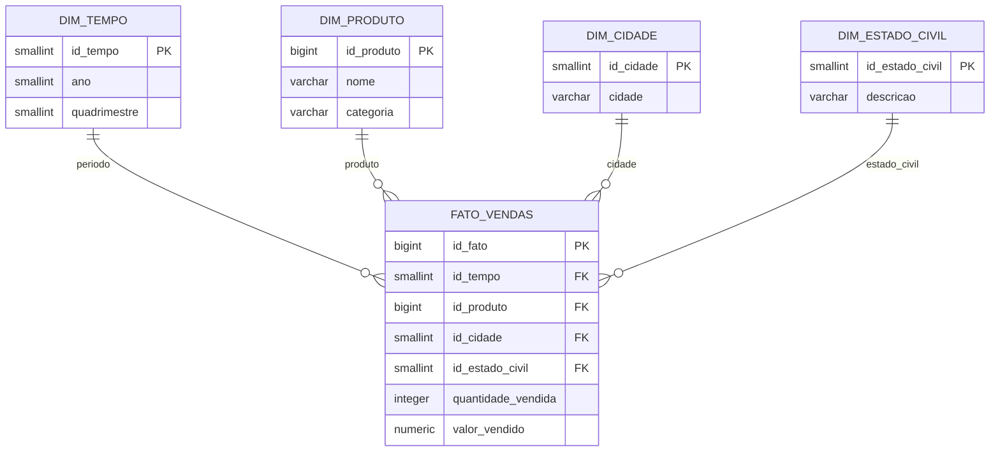

# Mineração de Dados — Pet Shop Nosso Aumigo

Este projeto integra as vendas de produtos das filiais Salvador, Itabuna e Feira de Santana em um banco OLAP PostgreSQL. A primeira versão da camada Gold deliberadamente contempla somente as vendas próprias; a planilha da concorrência permanece disponível como fonte, mas não é carregada no modelo estrela.

## Arquitetura medalhão

```text
Bronze  -> fontes brutas: Oracle, PostgreSQL, MongoDB e Excel
Silver  -> itens de venda próprios, padronizados e ainda sem agregação
Gold    -> esquema estrela PostgreSQL, agregado para análise
```

- **Bronze:** os repositórios extraem os dados sem aplicar regra analítica.
- **Silver:** cada item de venda recebe cidade da filial, estado civil normalizado, produto/categoria padronizados, ano e quadrimestre. Seu grão continua sendo um item de venda.
- **Gold:** consolida os itens no grão `ano × quadrimestre × produto × cidade × estado civil`.

## Esquema estrela Gold



**Grão da fato:** uma linha para cada combinação de `ano × quadrimestre × produto × cidade × estado civil`.

`fato_vendas` possui as medidas `quantidade_vendida` e `valor_vendido`. Não há dimensão diária, mês, UF, cliente, sexo ou serviços, pois eles não são necessários para os indicadores definidos nesta etapa. O DDL físico está em [`data/olap/01_olap_ddl.sql`](data/olap/01_olap_ddl.sql).

## Definition of Done — etapa atual

| Item | Situação |
| --- | --- |
| Integração das vendas próprias de Salvador, Itabuna e Feira de Santana | Concluído |
| Padronização Silver no grão de item de venda | Concluído |
| Estrela Gold e carga no PostgreSQL OLAP | Concluído |
| Indicadores por produto/categoria, cidade, quadrimestre/ano e estado civil | Cobertos pelo modelo |
| Comparação com a concorrência | **Não implementado** |

A planilha da concorrência está preservada na fonte Bronze, mas não entra na Silver ou Gold. Ela contém somente valor mensal de vendas, sem quantidade, produto, cidade ou perfil de cliente; por isso, a estratégia de modelagem e o indicador de comparação serão validados com o professor antes de uma nova implementação.

## Subir as bases

Crie `.env` a partir de `.env.example` caso queira trocar portas ou credenciais. Os valores de desenvolvimento já têm padrões em `docker-compose.yml`.

```bash
docker compose up -d --build
docker compose logs -f mongodb-loader
```

Além das três fontes operacionais, a composição inicia `postgres-olap` na porta `5433`. O esquema Gold é criado automaticamente na primeira inicialização do volume.

Para recriar todas as bases locais e suas cargas iniciais:

```bash
docker compose down -v
docker compose up -d --build
```

## Executar o ETL

```bash
uv sync

uv run python main.py verificar-conexoes
uv run python main.py carregar-olap
```

`uv sync` cria/atualiza o ambiente virtual conforme o `uv.lock`, garantindo as mesmas versões de dependências para todos. `carregar-olap` executa Bronze → Silver → Gold e substitui o conteúdo das dimensões e da fato no PostgreSQL OLAP por uma carga completa e consistente.

## Organização do código

| Pasta | Responsabilidade |
| --- | --- |
| `data/` | Dados das fontes e DDL do OLAP. |
| `models/` | Contratos Bronze, Silver e Gold. |
| `repositories/` | Extração das fontes e carga PostgreSQL do Gold. |
| `services/` | Transformação e orquestração do pipeline. |
| `docker/` | Imagens das fontes e do PostgreSQL OLAP. |
| `tests/` | Testes das regras Silver e Gold. |

As conexões Python usam `localhost` por padrão. Dentro de um container, use os hosts `oracle`, `postgres`, `mongodb` e `postgres-olap`.
